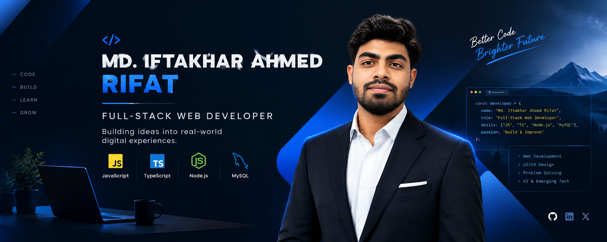

  

<h1 align="center">Hi 👋, I'm MD Iftakhar ahmed rifat</h1>

  

- 🔭I'm currently working with **JavaScript, TypeScript, Node.js, MySQL, Tailwind CSS, HTML & CSS**

- 🌱 I’m currently learning **React.js, advanced TypeScript, REST APIs & backend architecture**

- 👯 I’m looking to collaborate on **Full-stack web applications, E-commerce platforms, SaaS products, Developer tools and useful web applications, Open-source projects**

- 🤝 I’m looking for help with **Advanced TypeScript, Backend architecture and API design,Database optimization, Scalable full-stack application development ,AI integration in web applications**

- 👨‍💻 All of my projects are available at [https://portfolio-ochre-five-19.vercel.app/](https://portfolio-ochre-five-19.vercel.app/)

- 💬 Ask me about **JavaScript, TypeScript, Node.js, MySQL & web development.**

- 📫 How to reach me **iftakherahmed73214@gmail.com**

- ⚡ Fun fact **I enjoy turning random ideas into working web projects — if I can imagine it, I’ll probably try to build it.**

<h3 align="left">Connect with me:</h3>

<!-- ===================== TECHNOLOGY STACK ===================== -->

<h2 align="left">🛠️ Technology Stack:</h2>

<h3 align="left">Languages:</h3>

  
  
  
  
  
  

<h3 align="left">CSS Frameworks & Libraries:</h3>

  

<h3 align="left">JavaScript Frameworks & Libraries:</h3>

  

<h3 align="left">Database & Backend:</h3>

  
  
  
  

<h3 align="left">Design & Graphics:</h3>

  

<h3 align="left">Tools & Technologies:</h3>

  
  

<!-- ===================== GITHUB STATS ===================== -->

&nbsp;

